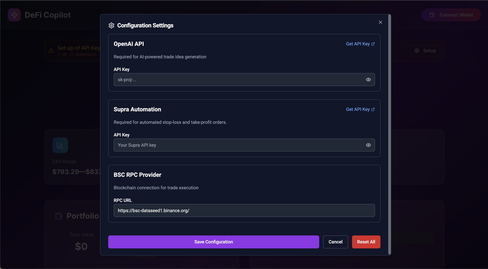
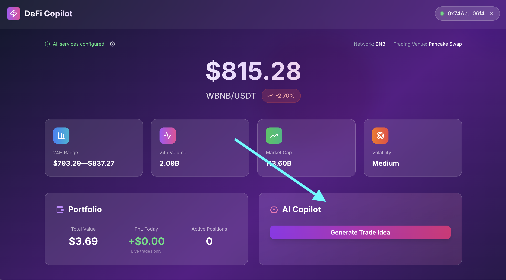
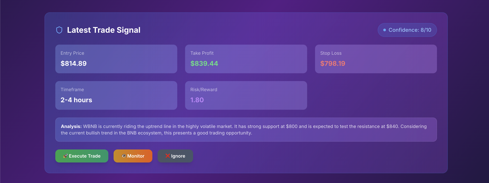
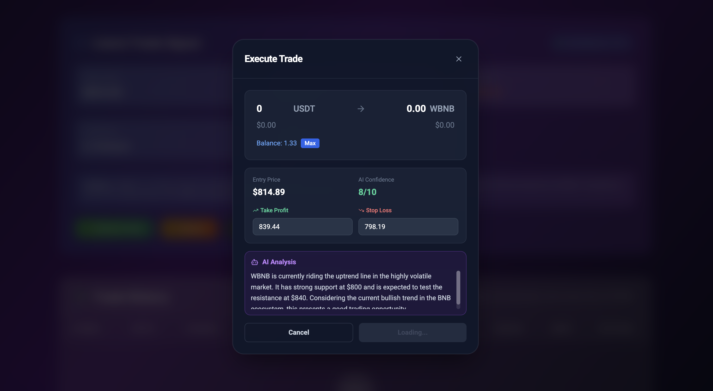
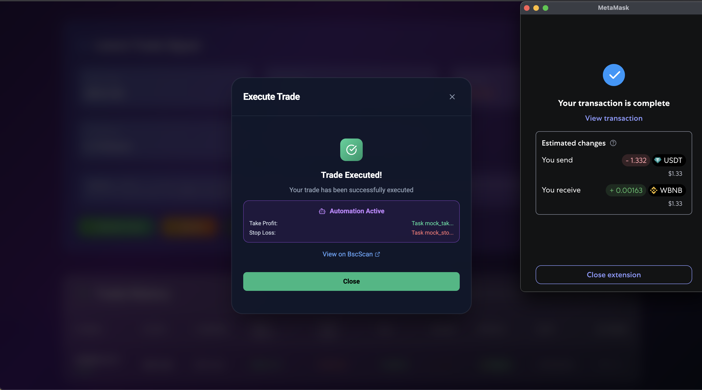
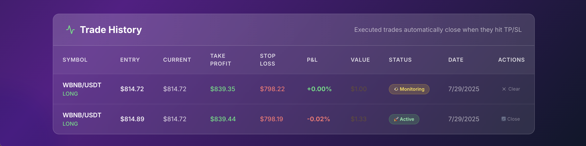

# **DeFi Trading Copilot: Step-by-Step User Guide**

## **🚀 Getting Started**

### **Step 1: Deploy & Access the App**
**Choose your deployment method:**

**🎯 Option A: NodeOps One-Click Deploy** (Recommended)
1. **Purchase the template** on [NodeOps marketplace](https://nodeops.xyz)
2. **Click "Deploy Now"** for instant one-click deployment
3. **Get your live URL** automatically (e.g., `https://your-app.nodeops.xyz`)
4. **Open the URL** in your browser

**🐳 Option B: Docker Self-Host**
1. **Deploy using Docker** on your own server
   ```bash
   docker run -p 3000:80 defi-trading-copilot
   ```
2. **Open your browser** and go to `http://localhost:3000`

3. **You'll see the main dashboard** with a setup prompt

---

## **⚙️ Initial Setup (One-Time)**

### **Step 2: Configure Your API Keys**
1. **Click "Configure Now"** or the settings button in the header
2. **The configuration modal opens** with four sections



### **Step 3: Add Required Services**
**Add these API keys in order:**

**🤖 OpenAI API** (Required)  
1. Go to [platform.openai.com](https://platform.openai.com/api-keys)
2. Create API key (starts with `sk-`)
3. Paste into OpenAI field

**📊 Supra Automation** (Required)
1. Go to [supra.com](https://supra.com) to get API key
2. Paste into Supra field 

---

## **🔗 Connect Your Wallet**

### **Step 4: Connect MetaMask**
1. **Click "Connect Wallet"** in the top right
2. **Select MetaMask** from the options
3. **Approve the connection** in MetaMask popup
4. **Make sure you're on BSC network** (Chain ID: 56)

---

## **📊 Getting Your First AI Trade Idea**

### **Step 5: Generate AI Recommendation**
1. **Check the price widget** showing current BNB price
2. **Click "Get AI Trade Idea"** button
3. **Wait for AI analysis** (takes 5-10 seconds)



### **Step 6: Review AI Suggestion**
**The AI trade card appears with:**
- **Entry Price** - When to buy
- **Take Profit** - When to sell for profit  
- **Stop Loss** - When to sell to limit losses
- **Confidence Score** - AI's confidence (1-10)
- **Reasoning** - Why this trade makes sense
- **Timeframe** - How long to hold



---

## **🎯 Choosing Your Action**

### **Step 7: Decide What To Do**
**You have 3 options:**

**🚫 Ignore** - Dismiss this trade idea
- Click **"Ignore"** if you don't like the suggestion
- Card disappears, no record kept

**👁️ Monitor** - Paper trade (practice mode)
- Click **"Monitor"** to watch without real money
- Trade gets added to your history for learning

**🚀 Execute** - Real trade with automation
- Click **"Execute"** to trade with real money
- Opens execution modal for final confirmation

---

## **💰 Executing a Real Trade**

### **Step 8: Trade Execution Modal**
**When you click "Execute", a detailed modal opens:**

1. **Review trade details** - Entry, targets, amounts
2. **Set trade amount** - How much USDT to trade (default: $100)
3. **Adjust take profit/stop loss** if desired
4. **Review fees and slippage**



### **Step 9: Confirm & Execute**
1. **Click "Execute Trade"**
2. **App checks token approvals** automatically
3. **MetaMask prompts for approval** (if needed)
4. **Approve the transaction**
5. **Second MetaMask prompt for the swap**
6. **Approve the swap transaction**

### **Step 10: Automation Setup**
**After successful swap:**
1. **App automatically sets up automation** with Supra
2. **Take profit and stop loss orders activate**
3. **Success message appears** with transaction hash
4. **Trade appears in your history**



---

## **📈 Monitoring Your Trades**

### **Step 11: Track Performance**
1. **Scroll down to "Trade History"** section
2. **See all your trades** with current P&L
3. **Green = profit, Red = loss**
4. **Click transaction hash** to view on BSC scan



### **Step 12: Automation Working**
**Your automated orders work 24/7:**
- **Take profit triggers** when price hits target
- **Stop loss activates** if price drops too much
- **You get notifications** when orders execute
- **No need to watch charts constantly**


## **🎉 You're Ready to Trade!**